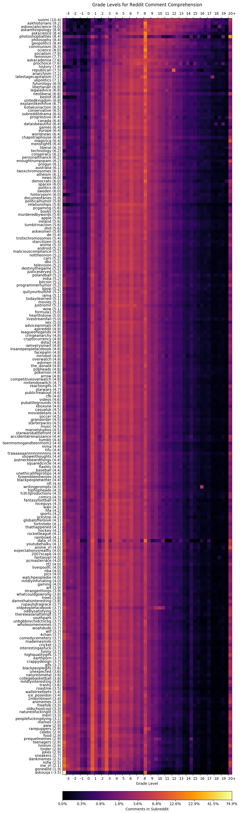

# Grade for Reddit

Scrape Reddit comments and evaluate them using the [Flesch-Kincaid grade level algorithm](https://en.wikipedia.org/wiki/Flesch%E2%80%93Kincaid_readability_tests#Flesch%E2%80%93Kincaid_grade_level)

## Requirements

* python 3
* praw

    `pip3 install praw`
* numpy

    `pip3 install numpy`
* matplotlib

    `pip3 install matplotlib`
* modified textstat, included with this project. You still need textstat's dependencies:

    `pip3 install textstat`

    or

    `pip3 install pyphen repoze.lru`

## Usage

1. Add reddit API credentials.

   You can generate API keys [here](https://www.reddit.com/prefs/apps)

   `cred.json`:

   ```json
   {
       "client_id": "public id",
       "client_secret": "secret key",
       "user_agent": "script:my-app-name:v0.0.1 (by /u/me)"
   }
   ```

2. Generate sub list

   `./find_subs.py` will find popular subs, and add some interesting ones.

   If you only want to grade select subreddits, you can manually write a sub list, in `subs.txt`, one subreddit name per line.

3. Grade comments from the subs.

   `./grade.py` reads from `subs.txt`, loads reddit comments from those subs, and writes to `grades.txt`.

   You may want to adjust `post_limit`, and `more_limit` in the script.

4. Analyze the grades to create a histogram and median.

   `./stats.py` reads `grades.txt` and outputs `stats.txt`

5. Plot the data

   `./plot.py` reads `stats.txt` and plots a heatmap. You may need to manually adjust figure size.

## Result

225 subreddits, using top of last month, from Febuary 2018:


